# CinemaManager

## Ομάδα
- Αλέξανδρος Γεωργιάδης (ΑΜ: 321/2022024)
- Κωνσταντίνος Κωστίνας (ΑΜ: 321/2022089)
- Δεσπόνυμος Μάριος Ελένης (ΑΜ: 321/2023051)

Εφαρμογή για **διαχείριση φεστιβάλ/κινηματογράφου**: προγράμματα (programs), προβολές/αιτήσεις (screenings), χρήστες & audit log.


Το repo περιέχει:
- **Backend**: Spring Boot (Java 21) με JWT security, H2 (in-memory) και Flyway migrations.
- **Frontend**: React + Vite + TypeScript + Tailwind (στον φάκελο `cinema-frontend/`).

---

## Screenshots

> Τα screenshots βρίσκονται στο: `docs/screenshots/`

### Public (Visitor) – Programs
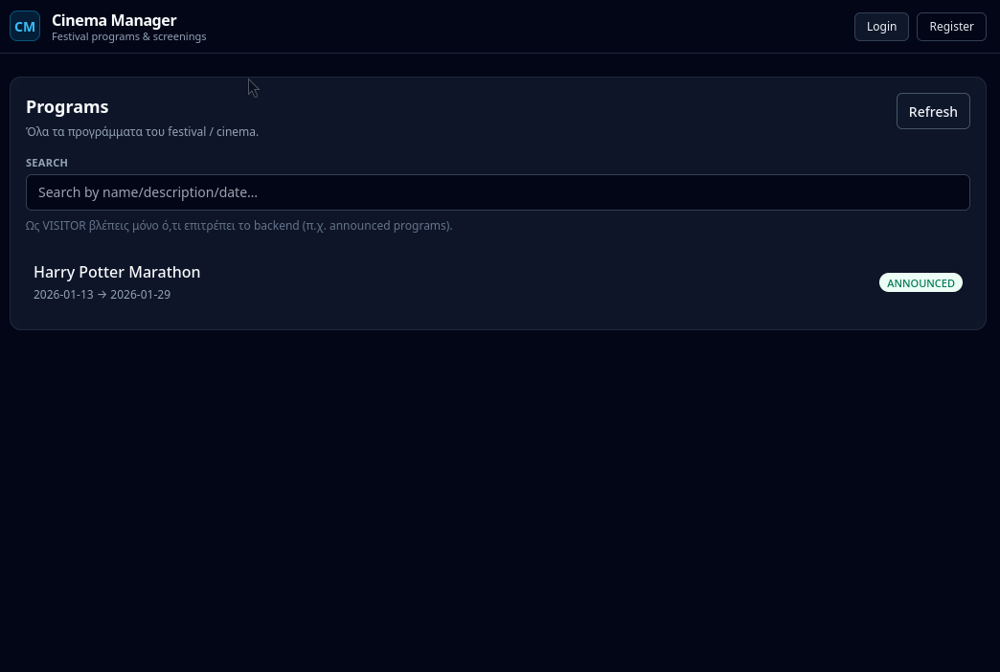

### Public (Visitor) – Program details
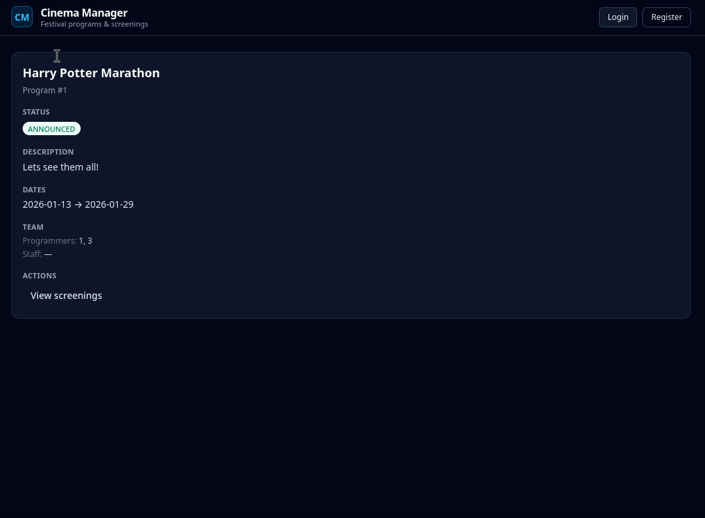

### Public (Visitor) – Program timetable
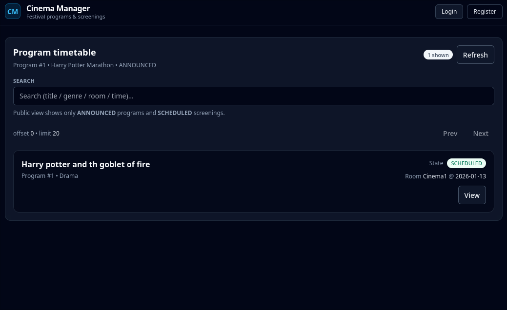

### Login
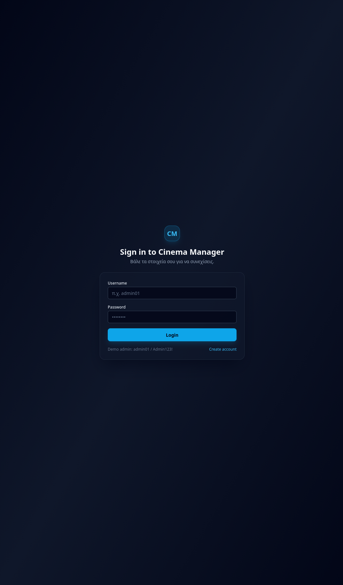

### Register
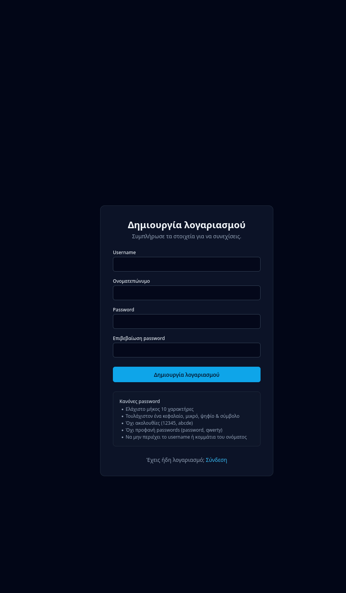

### Create program
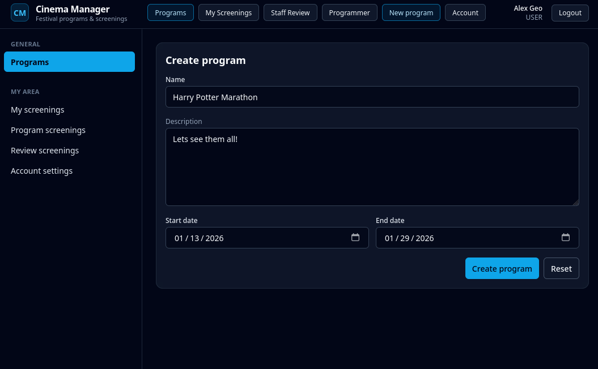

### Program details (creator view)
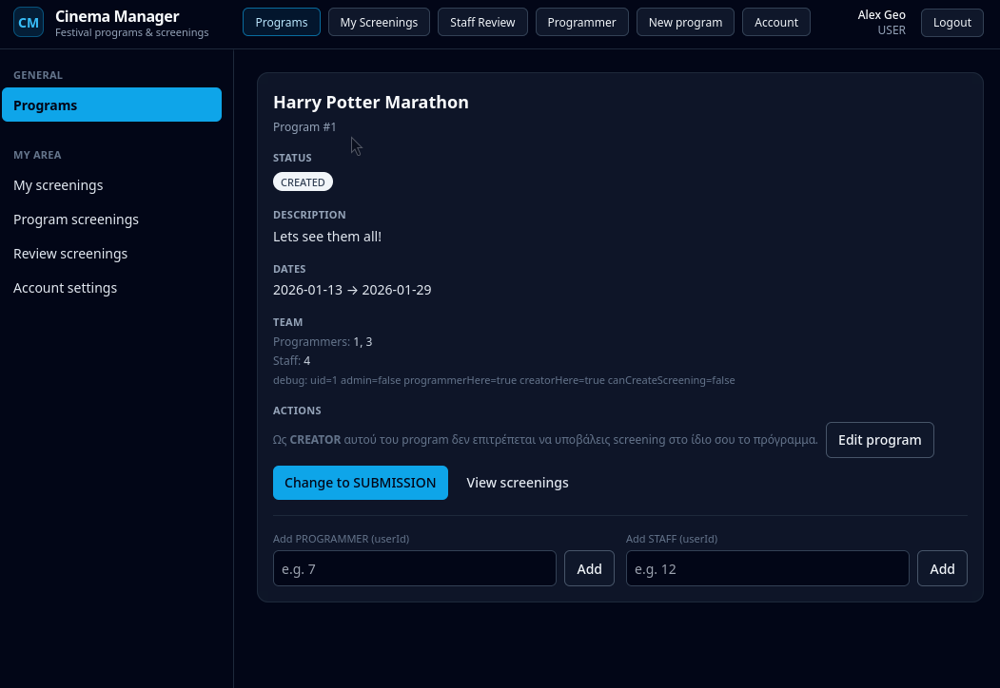

### Create screening
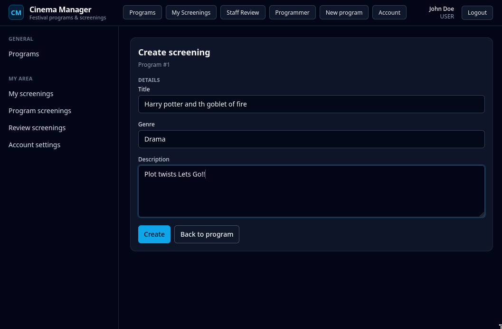

### Staff – Review queue
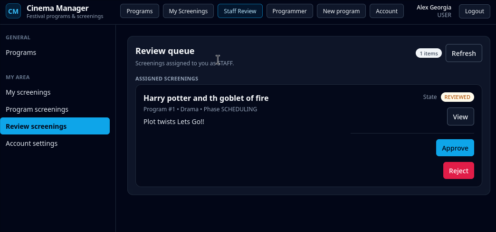

### Programmer – Assignment phase
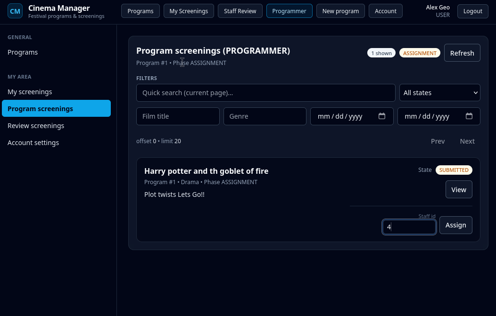

### Programmer – Final publication phase
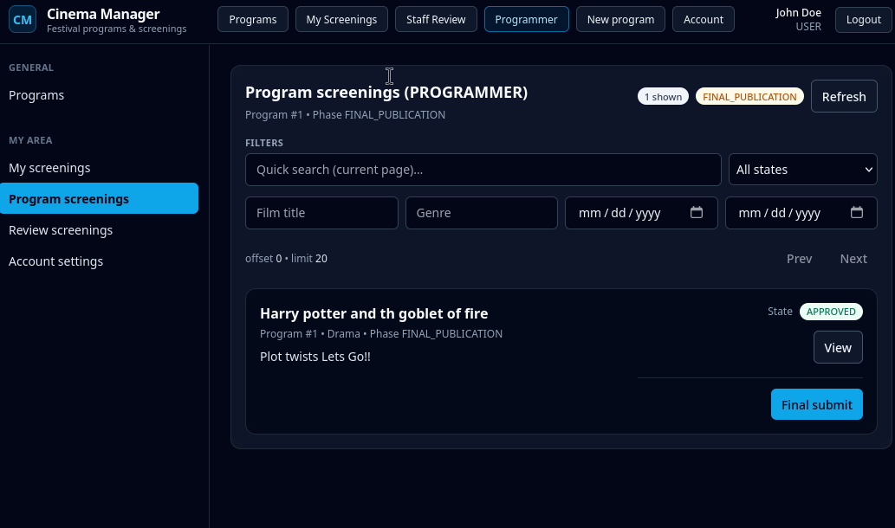

### Programmer – Decision phase (schedule / reject)
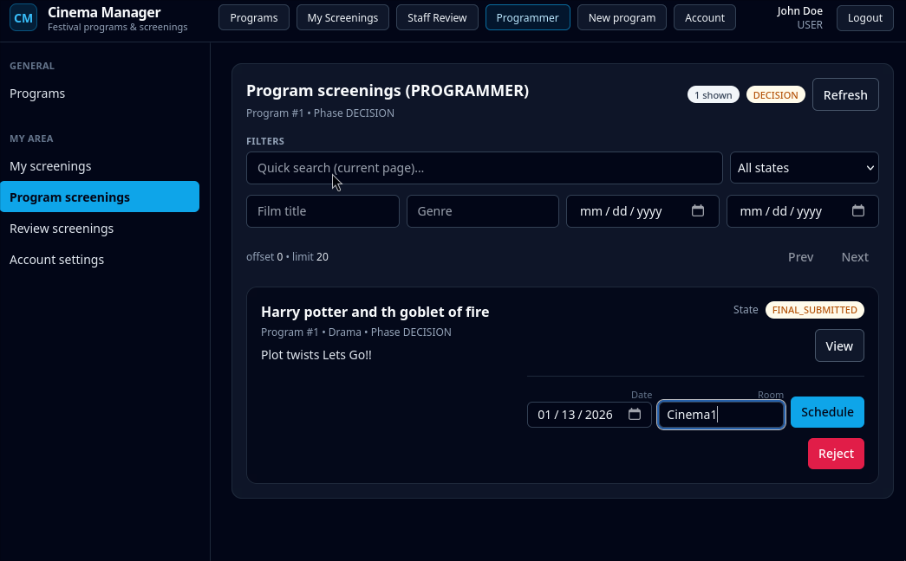

### Admin – User management
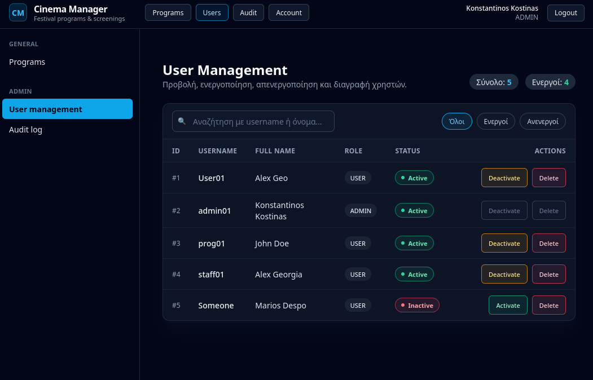

### Admin – Audit log
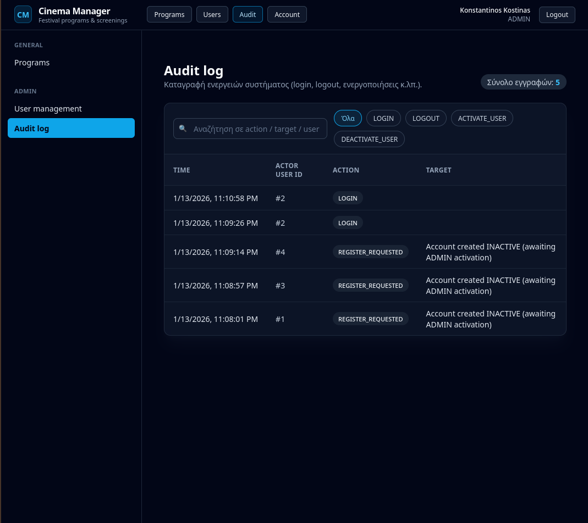

---

## Features (high level)

- **Authentication / Authorization**
  - Register, Login, Logout
  - JWT bearer token
  - Role-based πρόσβαση (βασικοί ρόλοι: `USER`, `ADMIN`)
- **Programs**
  - Δημιουργία/ενημέρωση/διαγραφή
  - Αναζήτηση με φίλτρα (όνομα, state, ημερομηνίες)
  - Ανάθεση χρηστών ως *programmers* / *staff* σε πρόγραμμα
  - State machine για αλλαγές κατάστασης (π.χ. CREATED -> SUBMISSION -> …)
- **Screenings**
  - Δημιουργία/ενημέρωση, submit/withdraw
  - Assignment staff handler, review, approve/reject, final submit
  - Scheduling (ημέρα + αίθουσα)
  - Public & full views ανάλογα με δικαιώματα
- **Audit logs**
  - Καταγραφή ενεργειών (admin endpoint για προβολή)

---

## Tech Stack

### Backend
- Java 21
- Spring Boot 3.x
- Spring Security + JWT
- Spring Data JPA
- H2 (in-memory) + Flyway (`src/main/resources/db/migration`)
- OpenAPI/Swagger UI (springdoc)

### Frontend
- React 18
- Vite
- TypeScript
- Tailwind CSS
- Axios
- React Router
- Zustand (state management)

---

## Quick start

### Prerequisites
- **Java 21**
- **Maven** 
- **Node.js 18+** 

### 1) Backend (Spring Boot)

```bash
# από τον root φάκελο του project
mvn clean spring-boot:run
```

- Backend τρέχει στο: `http://localhost:8080`
- H2 console: `http://localhost:8080/h2-console`
- Swagger UI (συνήθως): `http://localhost:8080/swagger-ui/index.html`

> Η βάση είναι in-memory (H2). Με restart χάνεται το περιεχόμενο.

### 2) Frontend (React)

```bash
cd cinema-frontend
npm install
npm run dev
```

- Frontend τρέχει στο: `http://localhost:5173`

> Το frontend περιμένει backend διαθέσιμο για τα `/api/**` requests.

---

## Configuration

Το βασικό configuration βρίσκεται στο:

- `src/main/resources/application.yml`

Σημαντικά σημεία:
- H2 datasource: `jdbc:h2:mem:cinema`
- Flyway enabled
- JWT secret & expiration
- Server port: `8080`

---

## API (ενδεικτικά endpoints)

### Auth (`/api/auth`)
- `POST /api/auth/register`
- `POST /api/auth/login`
- `POST /api/auth/logout`
- `GET  /api/auth/validate`

### Programs (`/api/programs`)
- `POST   /api/programs`
- `PUT    /api/programs/{id}`
- `DELETE /api/programs/{id}`
- `GET    /api/programs/{id}`
- `GET    /api/programs` (filters: `name`, `programState`, `from`, `to`, `offset`, `limit`)
- `POST   /api/programs/{id}/programmers/{userId}`
- `POST   /api/programs/{id}/staff/{userId}`
- `PUT    /api/programs/{id}/state`

### Screenings (`/api/screenings`)
- `POST   /api/screenings?programId=...`
- `PUT    /api/screenings/{id}`
- `PUT    /api/screenings/{id}/submit`
- `PUT    /api/screenings/{id}/withdraw`  *(ή `DELETE /api/screenings/{id}` ως withdraw)*
- `PUT    /api/screenings/{id}/handler/{staffId}`
- `PUT    /api/screenings/{id}/review?score=...&comments=...`
- `PUT    /api/screenings/{id}/approve`
- `PUT    /api/screenings/{id}/final-submit`
- `PUT    /api/screenings/{id}/reject?reason=...`
- `PUT    /api/screenings/{id}/schedule?date=YYYY-MM-DD&room=...`
- `GET    /api/screenings/{id}`
- `GET    /api/screenings/by-program?programId=...` *(filters: title/genre/dates/state + `timetable` flag)*
- `GET    /api/screenings/by-submitter`
- `GET    /api/screenings/by-staff`

### Admin
- `GET /api/admin/users`
- `PUT /api/admin/users/{id}/activate`
- `PUT /api/admin/users/{id}/deactivate`
- `DELETE /api/admin/users/{id}`
- `POST /api/admin/users/{id}/logout`
- `GET /api/admin/audit-logs`

---

## Project structure (backend)

```
src/main/java/com/cinema
├─ domain/            # Entities, Value Objects, policies, ports (hexagonal)
├─ application/       # Use-cases (business flows)
├─ infrastructure/    # JPA repos, security impl, config
└─ presentation/      # REST controllers + DTOs + mappers
```

---


